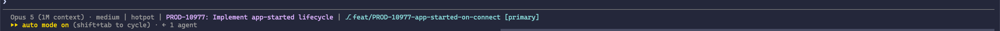
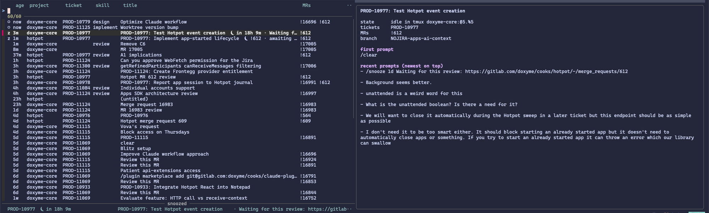

# dotfiles

My macOS setup: zsh, tmux, Neovim, and a set of Claude Code tooling for working across several sessions at once.

Everything under `home/` mirrors `~`. The linker symlinks each entry into place, files directly and directories one level deep, so `~/.config/nvim` points at `home/.config/nvim` while anything else in `~/.config` is left alone. It asks before replacing a file that differs.

```sh
git clone git@github.com:Evilbits/dotfiles.git ~/dotfiles
cd ~/dotfiles && ./linker.sh
```

## Setup on a new machine

```sh
brew install zsh tmux neovim fzf fnm fd ripgrep glab terminal-notifier koekeishiya/formulae/skhd
sh -c "$(curl -fsSL https://raw.githubusercontent.com/ohmyzsh/ohmyzsh/master/tools/install.sh)"
git clone https://github.com/zsh-users/zsh-autosuggestions ~/.oh-my-zsh/custom/plugins/zsh-autosuggestions
git clone https://github.com/zsh-users/zsh-syntax-highlighting ~/.oh-my-zsh/custom/plugins/zsh-syntax-highlighting
git clone https://github.com/tmux-plugins/tpm ~/.tmux/plugins/tpm
fnm install 24 && fnm default 24
./linker.sh
```

Afterwards: `prefix + I` inside tmux installs its plugins, the first `nvim` start installs the Neovim plugins, `skhd --start-service` turns on the app hotkeys, and the two Claude Code steps at the end of this file finish the job.

## Tooling

**zsh** (`home/.zshrc`). oh-my-zsh with autosuggestions and syntax highlighting. Node comes from fnm and switches version on `cd`. Aliases for git and kubectl, `vim` for `nvim`, `nx` for `pnpm nx`. Custom fzf widgets live in `home/.config/fzf`.

**tmux** (`home/.tmux.conf`). Prefix is `C-a`. Panes move with `hjkl`, split with `x` and `v`, and `c` opens a window in the current path. Three fzf pickers: `prefix t` for tmux sessions, `prefix r` for Claude sessions, `prefix b` for git branches. Plugins through tpm: tmux-fzf and tmux-mode-indicator. The status bar shows memory use via `home/.config/tmux/mem-percentage.sh`.

**Neovim** (`home/.config/nvim`). lazy.nvim with one file per plugin under `lua/plugins/`: LSP, blink completion, treesitter, telescope, nvim-tree, git, Copilot, claudecode.nvim, lualine, zen mode. General keymaps are in `lua/config.lua`; each plugin keeps its own.

**Theme.** Catppuccin Macchiato throughout: `home/catppuccin-macchiato.toml` for Alacritty, and the same palette in tmux, Neovim and the Claude status line.

**skhd** (`home/.config/skhd`). `cmd-1`, `cmd-2`, `cmd-3` focus or cycle Zen, Slack and Alacritty.

**git** (`home/.config/git/ignore`). The global ignore list.

**Specs** (`home/.config/claude/specs`). Design briefs and implementation plans written with Claude. They live here so they never end up in a work repository.

## Claude Code

`home/.claude` holds the global instructions, the settings with their hooks, and the session tooling. Its `.gitignore` tracks only those; everything Claude writes at runtime stays out of the repo. The skills live in the company skills directory.

### Hooks

A guard on Bash denies bypassing git hooks, `npx nx` and `git add .`, and asks before anything that rewrites history or deletes. Edited files are formatted with the nearest `oxfmt`. A banner at session start lists every snoozed session, due first.

### Status line



`model · effort | repo | ticket · session name | snooze | branch`. The ticket is worked out from the session's own prompts, so it is there even when Claude's generated title leaves it out. A snoozed session shows its remaining time or the MR it is waiting on, and every session shows a count when snoozes are due.

### Session picker: `prefix r`



An fzf list of every Claude session across repos, built from the transcripts and the live registry. Each row shows state, age, repo, ticket, skill, title and MRs. The order is due, live, snoozed, then closed by age, and the order holds while you type. The ticket is taken from what you typed in the session, then from the title, then from Claude's replies, then from the branch, which is how a review session opened with only an MR URL still lists under the right key.

| Key | Action |
| --- | --- |
| `Enter` | Jump to a running session's tmux pane, or resume a closed one in a new window in that repo's tmux session. Clears its snooze. |
| `ctrl-s` | Snooze the highlighted session. |
| `ctrl-u` | Unsnooze it. |
| `ctrl-z` | Show only snoozed sessions; again to go back. |
| `ctrl-y` | Copy the session id. |
| `End`, `Home` | Bottom and top of the list. |

The preview pane shows the title, whether it is running and where, snooze details, tickets, MRs, skills, branch, the first prompt and the latest prompts. A footer keeps every snoozed session in view with its remaining time.

### Snoozing

A snooze parks a session until a time, until something happens on a GitLab MR, or whichever comes first. Inside a session, type `/snooze` followed by the same words; from a shell, `current` means the session in this tmux pane.

```sh
claude-sessions --snooze current 3d awaiting review on !17005
claude-sessions --snooze current https://gitlab.com/doxyme/cooks/hotpot/-/merge_requests/612 awaiting review
claude-sessions --snooze current https://gitlab.com/doxyme/cooks/hotpot/-/merge_requests/612 merge next step
claude-sessions --snooze current fri https://gitlab.com/doxyme/cooks/hotpot/-/merge_requests/612 whichever comes first
claude-sessions --unsnooze current
```

Durations are `30s`, `45m`, `2h`, `3d`, `tomorrow`, a weekday such as `fri`, or a time such as `14:30`; anything in days lands at 09:00. An MR on its own wakes on a comment by someone else, an approval, a failed pipeline, a conflict, merge or close. `merge` after the URL wakes only on merge or close.

A launchd job checks every minute. When a snooze fires you get a notification that opens the session when clicked, the session moves to the top of the picker marked due, the status line in every session shows a due count, and a closed session is reopened in tmux. `claude-sessions --due` lists what is snoozed, `--wake` runs the check by hand, and the log is at `~/.local/state/claude-sessions/wake.log`.

Two one-off steps on a new machine:

```sh
claude-sessions --install-wake
security add-generic-password -a "$USER" -s claude-sessions-gitlab -w "$GITLAB_NPM_TOKEN"
```

The first installs the launchd job. The second stores the GitLab token in the login keychain, since the job runs without a shell environment. Allow `terminal-notifier` under System Settings → Notifications when the first reminder appears.
