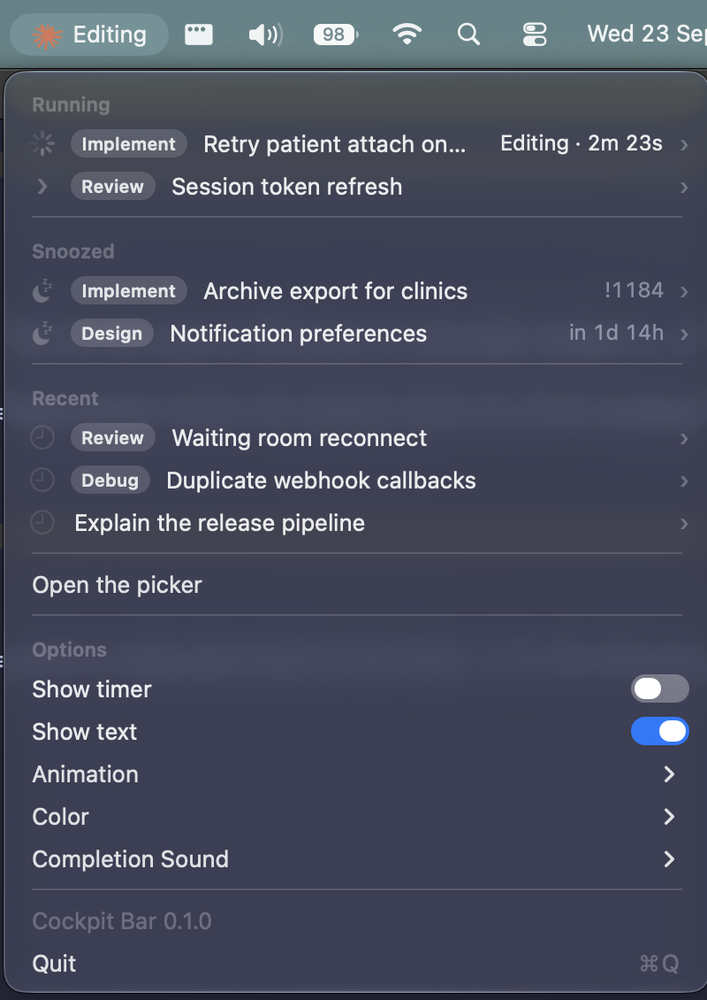

# dotfiles

My macOS setup: zsh, tmux, Neovim, and a set of Claude Code tooling for working across several sessions at once.

Everything under `home/` mirrors `~`. The linker symlinks each entry into place, files directly and directories one level deep, so `~/.config/nvim` points at `home/.config/nvim` while anything else in `~/.config` is left alone. It asks before replacing a file that differs.

```sh
git clone git@github.com:Evilbits/dotfiles.git ~/dotfiles
cd ~/dotfiles && ./linker.sh
```

## Setup on a new machine

```sh
brew install zsh tmux neovim fzf fnm fd ripgrep glab terminal-notifier koekeishiya/formulae/skhd
sh -c "$(curl -fsSL https://raw.githubusercontent.com/ohmyzsh/ohmyzsh/master/tools/install.sh)"
git clone https://github.com/zsh-users/zsh-autosuggestions ~/.oh-my-zsh/custom/plugins/zsh-autosuggestions
git clone https://github.com/zsh-users/zsh-syntax-highlighting ~/.oh-my-zsh/custom/plugins/zsh-syntax-highlighting
git clone https://github.com/tmux-plugins/tpm ~/.tmux/plugins/tpm
fnm install 24 && fnm default 24
./linker.sh
```

Afterwards: `prefix + I` inside tmux installs its plugins, the first `nvim` start installs the Neovim plugins, `skhd --start-service` turns on the app hotkeys, and the two Claude Code steps at the end of this file finish the job.

## Tooling

**zsh** (`home/.zshrc`). oh-my-zsh with autosuggestions and syntax highlighting. Node comes from fnm and switches version on `cd`. Aliases for git and kubectl, `vim` for `nvim`, `nx` for `pnpm nx`. Custom fzf widgets live in `home/.config/fzf`.

**tmux** (`home/.tmux.conf`). Prefix is `C-a`. Panes move with `hjkl`, split with `x` and `v`, and `c` opens a window in the current path. Three fzf pickers: `prefix t` for tmux sessions, `prefix r` for Claude sessions, `prefix b` for git branches. Plugins through tpm: tmux-fzf and tmux-mode-indicator. The status bar shows memory use via `home/.config/tmux/mem-percentage.sh`.

**Neovim** (`home/.config/nvim`). lazy.nvim with one file per plugin under `lua/plugins/`: LSP, blink completion, treesitter, telescope, nvim-tree, git, Copilot, claudecode.nvim, lualine, zen mode. General keymaps are in `lua/config.lua`; each plugin keeps its own.

**Theme.** Catppuccin Macchiato throughout: `home/catppuccin-macchiato.toml` for Alacritty, and the same palette in tmux, Neovim and the Claude status line.

**skhd** (`home/.config/skhd`). `cmd-1`, `cmd-2`, `cmd-3` focus or cycle Zen, Slack and Alacritty.

**git** (`home/.config/git/ignore`). The global ignore list.

**Specs** (`home/.config/claude/specs`). Design briefs and implementation plans written with Claude. They live here so they never end up in a work repository.

## Claude Code

`home/.claude` holds the global instructions, the settings with their hooks, and the session tooling. Its `.gitignore` tracks only those; everything Claude writes at runtime stays out of the repo. The skills live in the company skills directory.

### Hooks

A guard on Bash denies bypassing git hooks, `npx nx` and `git add .`, and asks before anything that rewrites history or deletes. Edited files are formatted with the nearest `oxfmt`. A banner at session start lists the doxyme skills.

### Session picker, snoozing and status line

These live in the `cockpit` plugin in the company marketplace (`doxyme/cooks/claude-plugins`, `plugins/cockpit`), installed with `/plugin install cockpit@doxyme` and wired in by `/cockpit:setup`. A copy of the plugin sits in `plugins/cockpit` here, with a redacted screenshot, refreshed by `scripts/sync-cockpit.sh`. This repo is a marketplace of its own (`.claude-plugin/marketplace.json`), so the copy installs without the company one: `/plugin marketplace add https://github.com/Evilbits/dotfiles` then `/plugin install cockpit@rasmus`.

### Menu bar app



`plugins/cockpit-bar` is a macOS menu bar app over cockpit, forked from [claude-status-bar](https://github.com/m1ckc3s/claude-status-bar). The menu bar shows a spinning splat while any Claude session works, with what it is doing ("Running command", "Editing", a thinking word) and an amber dot when one waits for permission. The dropdown lists sessions as `ticket · title` in four sections: due snoozes, running sessions with their activity and timer, snoozed sessions with what they wait for, and the recent closed ones. A click jumps to the session's tmux pane or resumes it; the flyout on each row has its repository and branch, start and last prompt times, its snooze, its merge requests grouped by repository with title and state, and the snooze actions.

It builds from source, so it needs the Xcode Command Line Tools (`xcode-select --install`), Node and the cockpit plugin:

```
/plugin marketplace add https://github.com/Evilbits/dotfiles
/plugin install cockpit-bar@rasmus
/cockpit-bar:setup
```

Setup compiles the app into `~/Applications/Cockpit Bar.app`, installs a LaunchAgent so it starts at login, and launches it. Run `/cockpit-bar:setup` again after a plugin update. The plugin README has the details.
