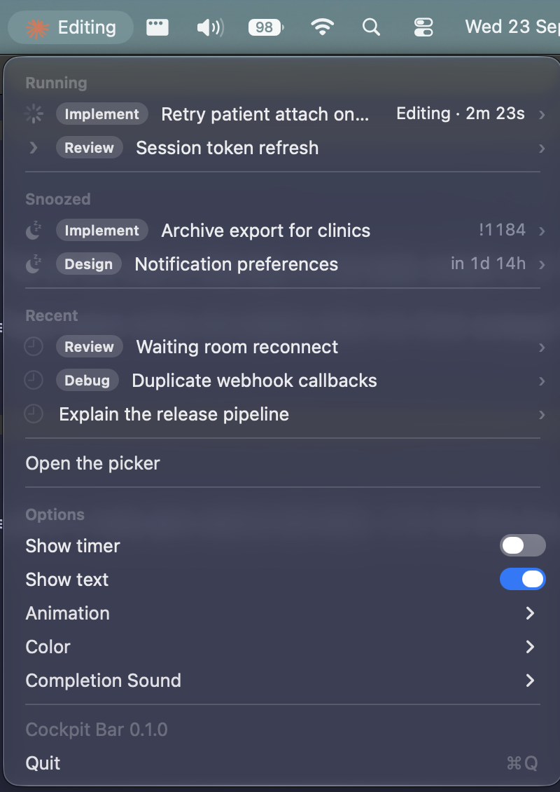

# dotfiles

My macOS setup: zsh, tmux, Neovim, and Claude Code tooling for working across several sessions at once.

Everything under `home/` mirrors `~`. The linker symlinks each entry into place: files directly, directories one level deep. So `~/.config/nvim` points at `home/.config/nvim`, and anything else in `~/.config` is left alone. It asks before replacing a file that differs.

```sh
git clone git@github.com:Evilbits/dotfiles.git ~/dotfiles
cd ~/dotfiles && ./linker.sh
```

## Setup on a new machine

```sh
brew install zsh tmux neovim fzf fnm fd ripgrep glab terminal-notifier koekeishiya/formulae/skhd
sh -c "$(curl -fsSL https://raw.githubusercontent.com/ohmyzsh/ohmyzsh/master/tools/install.sh)"
git clone https://github.com/zsh-users/zsh-autosuggestions ~/.oh-my-zsh/custom/plugins/zsh-autosuggestions
git clone https://github.com/zsh-users/zsh-syntax-highlighting ~/.oh-my-zsh/custom/plugins/zsh-syntax-highlighting
git clone https://github.com/tmux-plugins/tpm ~/.tmux/plugins/tpm
fnm install 24 && fnm default 24
./linker.sh
```

Then:

1. Inside tmux, `prefix + I` installs its plugins.
2. The first `nvim` start installs the Neovim plugins.
3. `skhd --start-service` turns on the app hotkeys.
4. Install the Claude Code plugins from the [Claude Code](#claude-code) section.

## Tooling

**zsh** (`home/.zshrc`)

- oh-my-zsh with autosuggestions and syntax highlighting.
- Node comes from fnm and switches version on `cd`.
- Aliases for git and kubectl, `vim` for `nvim`, `nx` for `pnpm nx`.
- Custom fzf widgets live in `home/.config/fzf`.

**tmux** (`home/.tmux.conf`)

- Prefix is `C-a`.
- Panes move with `hjkl` and split with `x` and `v`; `c` opens a window in the current path.
- Closing a window renumbers the rest, so new windows always open at the end.
- Three fzf pickers: `prefix t` for tmux sessions, `prefix r` for Claude sessions, `prefix b` for git branches.
- Plugins through tpm: tmux-fzf and tmux-mode-indicator.
- The status bar shows memory use via `home/.config/tmux/mem-percentage.sh`.

**Neovim** (`home/.config/nvim`)

- lazy.nvim with one file per plugin under `lua/plugins/`: LSP, blink completion, treesitter, telescope, nvim-tree, git, Copilot, claudecode.nvim, lualine, zen mode.
- General keymaps are in `lua/config.lua`; each plugin file keeps its own.

**Theme.** Catppuccin Macchiato throughout: `home/catppuccin-macchiato.toml` for Alacritty, and the same palette in tmux, Neovim and the Claude status line.

**skhd** (`home/.config/skhd`). `cmd-1`, `cmd-2` and `cmd-3` focus or cycle Zen, Slack and Alacritty.

**git** (`home/.config/git/ignore`). The global ignore list.

## Claude Code

`home/.claude` holds the global instructions, the settings with their hooks, and `specs`. Its `.gitignore` tracks only those, so nothing Claude writes at runtime reaches the repo.

### Workflow skills

`plugins/doxy` is one plugin with nine skills. Each is one step of the development flow:

- `/doxy:feature` interviews a product manager or designer about a feature in product words. It writes Jira tickets checked against the code, with an engineering-review spike on every point that crosses a platform boundary.
- `/doxy:vibe-app` takes such a ticket and a design to stacked app merge requests, boilerplate first. It self-reviews them against the Apps team's rules and stays blocked until engineering has answered every spike.
- `/doxy:vibe-app-setup` gets a non-engineer's Mac ready for that: the code, the tools and GitLab access, with no terminal typing.
- `/doxy:design` takes an idea to a brief the team can discuss.
- `/doxy:ticket` turns the brief into Jira tickets.
- `/doxy:implement` takes a ticket to a draft MR, with a review in a fresh context.
- `/doxy:blitz-test` tests a draft MR on a fresh blitz stack in real browsers, with the scenarios agreed during the work plus new edge cases, and leaves the stack up for more.
- `/doxy:review` reviews a change or a proposal from the Apps/SDK architecture frame.
- `/doxy:debug` takes a bug report through Datadog, Slack and the code to a short post mortem.

The skills also trigger on ordinary requests; the slash names are for invoking one on purpose. Briefs and post mortems go to `~/.claude/specs`, which here points at `home/.config/claude/specs` and on other machines is created on first use.

To install:

1. Add the marketplace and the plugin:

   ```
   /plugin marketplace add https://github.com/Evilbits/dotfiles
   /plugin install doxy@rasmus
   ```

2. Turn on auto-update. Claude Code leaves it off for marketplaces outside Anthropic's, so without it the skills stay on the version first installed. Run `/plugin`, open the **Marketplaces** tab, select `rasmus` and choose **Enable auto-update**. Every session start then fetches new versions.
3. Restart Claude Code so the skills load.

### Hooks

- A guard on Bash denies bypassing git hooks, `npx nx` and `git add .`, and asks before anything that rewrites history or deletes.
- Edited files are formatted with the nearest `oxfmt`.
- A banner at session start lists the doxy skills.
- The session renamer titles each new session after its first exchange.

### Session picker, snoozing and status line

These live in the `cockpit` plugin in the company marketplace (`doxyme/cooks/claude-plugins`). It is installed with `/plugin install cockpit@doxyme` and wired in by `/cockpit:setup`.

A copy sits in `plugins/cockpit` here, with a redacted screenshot, refreshed by `scripts/sync-cockpit.sh`. It installs without the company marketplace:

```
/plugin marketplace add https://github.com/Evilbits/dotfiles
/plugin install cockpit@rasmus
```

### Menu bar app



`plugins/cockpit-bar` is a macOS menu bar app over cockpit, forked from [claude-status-bar](https://github.com/m1ckc3s/claude-status-bar).

- **Menu bar.** A spinning splat while any Claude session works, with what it is doing ("Running command", "Editing", a thinking word). An amber dot means a session waits for permission.
- **Dropdown.** Sessions in four sections: due snoozes, running, snoozed, and recent closed ones. Each row shows the kind of work as a pill and what the session is about.
- **Click.** Jumps to the session's tmux pane, or resumes it.
- **Flyout.** Repository and branch, start and last prompt times, the snooze, the ticket, the merge requests grouped by repository, and the snooze actions.

It builds from source, so it needs the Xcode Command Line Tools (`xcode-select --install`), Node and the cockpit plugin:

1. Install and build:

   ```
   /plugin marketplace add https://github.com/Evilbits/dotfiles
   /plugin install cockpit-bar@rasmus
   /cockpit-bar:setup
   ```

   Setup compiles the app into `~/Applications/Cockpit Bar.app`, adds a LaunchAgent so it starts at login, and launches it.

2. Turn on auto-update for the `rasmus` marketplace, as in [Workflow skills](#workflow-skills).
3. After an update, run `/cockpit-bar:setup` again so the app is rebuilt from the new version.

The plugin README has the details.
